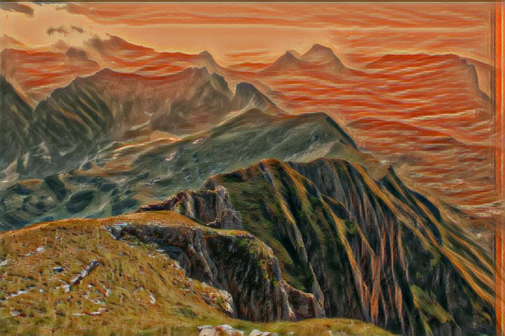

# AI Artify

### A [Twitter bot](https://twitter.com/ai_artify) that uses neural networks to transfer the style of famous paintings to featured images from the [Unsplash API](https://unsplash.com/developers).

## Examples

[Original](https://unsplash.com/photos/XeCvtUX-AE0)

[Original](https://unsplash.com/photos/-icmOdYWXuQ)

[Original](https://unsplash.com/photos/GyvMk5pPDXI)

Tweets are available at [@AI_Artify](https://twitter.com/ai_artify).

Image style transfer is done with [Logan Enstrom's](https://github.com/lengstrom) [Fast Style Transfer](https://github.com/lengstrom/fast-style-transfer).