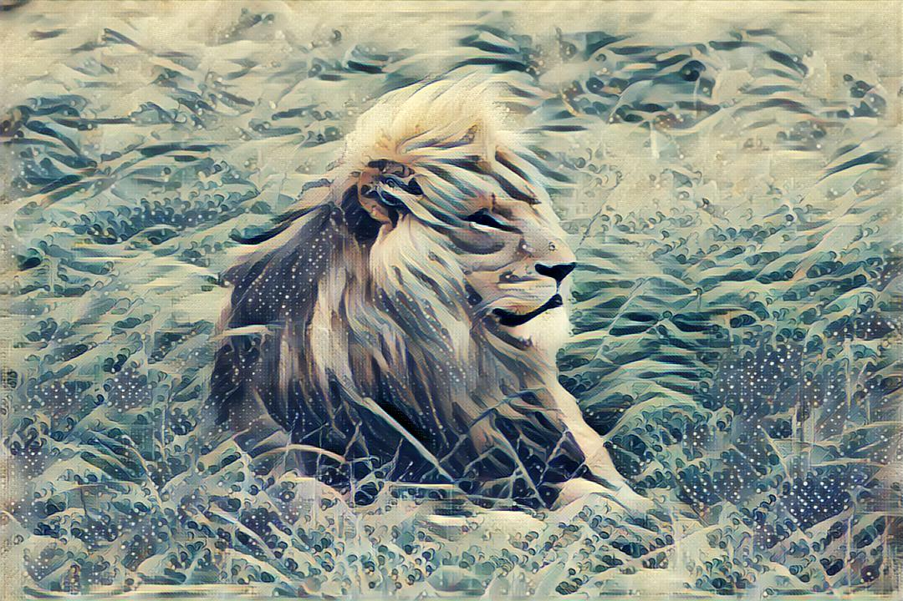
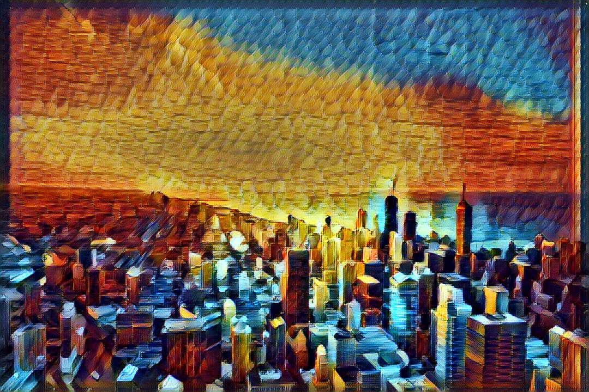
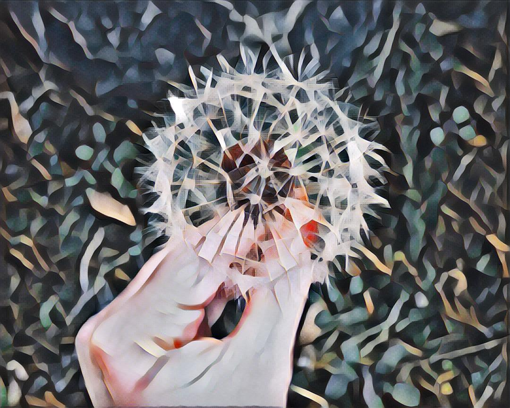

# AI Artify

### A [Twitter bot](https://twitter.com/ai_artify) that transfers the style of famous paintings to images from the [Unsplash API](https://unsplash.com/developers) every 6 hours.

## Examples

[Original](https://unsplash.com/photos/uh5AfvDwwdM)

[Original](https://unsplash.com/photos/-icmOdYWXuQ)

[Original](https://unsplash.com/photos/GyvMk5pPDXI)

Tweets are available at [@AI_Artify](https://twitter.com/ai_artify).

Image style transfer is done with [Logan Enstrom's](https://github.com/lengstrom) [Fast Style Transfer](https://github.com/lengstrom/fast-style-transfer).

## Quickstart

Just to quickly test that everything is working locally:

* Make an Unsplash developer account
* Make a Twitter developer account
* Make credentials.json -> `cp default.json credentials.json`
* Enter your Twitter and Unsplash credentials into `credentials.json`
* Install dependencies (example: `pip3 install -r  py3reqs.txt` )
* `python3 main.py`